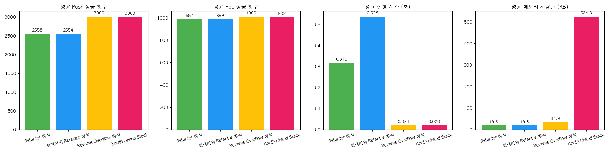
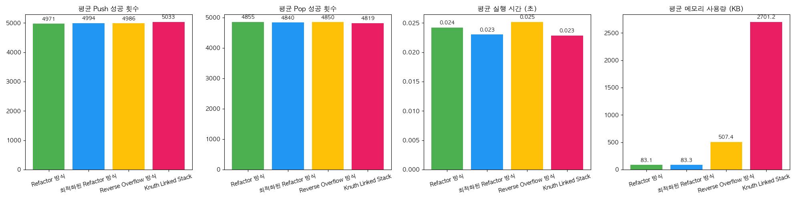

# Reverse Overflow-Based Multiple Stack

## Overview  
This project introduces a space-efficient data structure that enables **multiple stacks to coexist in a single array**, sharing memory intelligently.  
When a stack exceeds its own region, it can intrude into the free space of neighboring stacks **in reverse direction** — a strategy we call **Reverse Overflow**.

Compared to traditional equal partitioning, this approach offers significantly better space utilization and handles various scenarios without dynamic resizing.

## Features

- **Reverse Overflow Algorithm**  
  All stacks share a single fixed-size array. Each stack grows in its assigned direction, and if space runs out, it overflows *in reverse* into adjacent stack space.

- **No Dynamic Memory Allocation**  
  Operates entirely within a statically allocated array, maximizing memory efficiency.

- **Pop & Reclaim Logic**  
  When elements are popped, the structure reclaims and readjusts space, making it available for future pushes.

- **Performance Comparisons**  
  Benchmark results comparing this method with equal partitioning and Knuth’s linked stack can be found in [`docs/en/comparison.md`](./docs/en/comparison.md).

## Directory Structure

```
reverse-overflow-multistack/
├── README.md                  # Main project introduction (English)
├── README.ko.md               # Korean summary version
├── LICENSE
├── docs/
│   ├── en/
│   │   ├── structure.md       # Core concepts and algorithm design
│   │   ├── comparison.md      # Performance evaluation and comparison
│   │   ├── implementation.md  # Code-level implementation notes
│   │   └── faq.md             # Frequently asked questions
│   └── ko/
│       ├── structure.ko.md
│       ├── comparison.ko.md
│       ├── implementation.ko.md
│       └── faq.ko.md
├── src/                       # C source code
│   ├── main.c
│   ├── multiple_stack.c
│   └── multiple_stack.h
├── benchmarks/                # Python scripts for performance testing
│   ├── implementations.py
│   ├── test.py
│   └── images/                # Experimental result visualizations
│       ├── experiment_0.png
│       ├── experiment_1.png
│       ├── experiment_2.png
│       ├── experiment_3.png
│       └── experiment_4.png
└── CMakeLists.txt             # CMake build configuration
```


## Documentation

- [`structure.md`](./docs/en/structure.md) – Structure and core algorithm  
- [`comparison.md`](./docs/en/comparison.md) – Comparison with existing methods and trade-offs  
- [`implementation.md`](./docs/en/implementation.md) – Implementation details and logic  
- [`faq.md`](./docs/en/faq.md) – Frequently Asked Questions

---


## Performance Analysis

### Experiment Overview
This experiment compares the performance of four different methods (Refactor, Optimized Refactor, Reverse Overflow, Knuth Linked Stack) across multiple experimental conditions. Key performance metrics include Push and Pop counts, execution time, and memory usage. The results below highlight the advantages of each method based on varying conditions.

#### Experiment Conditions

1. **PUSH_RATIO=[0.2, 0.2, 0.2, 0.2, 0.2], NUM_STACKS=5, POP_PROB=0.1**

   | Method                | Push (Avg) | Pop (Avg)  | Time (Avg) | Memory (Avg) |
   |-----------------------|------------|------------|------------|--------------|
   | Refactor              | 2560.4     | 978.8      | 0.3169s    | 19.8KB       |
   | Optimized Refactor    | 2565.0     | 998.0      | 0.4612s    | 19.8KB       |
   | Reverse Overflow      | 2999.8     | 999.8      | 0.0212s    | 34.9KB       |
   | Knuth Linked Stack    | 3007.4     | 1007.6     | 0.0250s    | 524.3KB      |

   

2. **PUSH_RATIO=[0.95, 0.0025, 0.0025, ..., 0.0025], NUM_STACKS=21, POP_PROB=0.5**

   | Method                | Push (Avg) | Pop (Avg)  | Time (Avg) | Memory (Avg) |
   |-----------------------|------------|------------|------------|--------------|
   | Refactor              | 5008.2     | 4887.0     | 0.0426s    | 83.1KB       |
   | Optimized Refactor    | 4994.6     | 4844.2     | 0.0354s    | 83.2KB       |
   | Reverse Overflow      | 5005.0     | 4872.6     | 0.0334s    | 507.4KB      |
   | Knuth Linked Stack    | 4995.0     | 4872.0     | 0.0258s    | 2701.2KB     |

   

3. **PUSH_RATIO=[0.5, 0.5, 0.0, ..., 0.0], NUM_STACKS=10, POP_PROB=0.8**

   | Method                | Push (Avg) | Pop (Avg)  | Time (Avg) | Memory (Avg) |
   |-----------------------|------------|------------|------------|--------------|
   | Refactor              | 1993.8     | 1993.6     | 0.0182s    | 41.1KB       |
   | Optimized Refactor    | 2003.4     | 2001.8     | 0.0182s    | 41.2KB       |
   | Reverse Overflow      | 1993.0     | 1992.4     | 0.0201s    | 254.8KB      |
   | Knuth Linked Stack    | 1976.0     | 1974.6     | 0.0181s    | 1350.2KB     |

   

4. **PUSH_RATIO=[0.02, 0.02, ..., 0.02], NUM_STACKS=50, POP_PROB=0.5**

   | Method                | Push (Avg) | Pop (Avg)  | Time (Avg) | Memory (Avg) |
   |-----------------------|------------|------------|------------|--------------|
   | Refactor              | 4966.8     | 4454.2     | 0.0295s    | 165.1KB      |
   | Optimized Refactor    | 5008.6     | 4476.8     | 0.0297s    | 165.1KB      |
   | Reverse Overflow      | 4975.6     | 4453.2     | 0.0405s    | 1006.6KB     |
   | Knuth Linked Stack    | 5001.4     | 4465.0     | 0.0296s    | 5404.4KB     |

   

5. **PUSH_RATIO=[0.05, 0.05, ..., 0.05], NUM_STACKS=11, POP_PROB=0.2**

   | Method                | Push (Avg) | Pop (Avg)  | Time (Avg) | Memory (Avg) |
   |-----------------------|------------|------------|------------|--------------|
   | Refactor              | 5073.4     | 2002.8     | 1.0404s    | 83.0KB       |
   | Optimized Refactor    | 5014.4     | 1976.8     | 0.6730s    | 83.0KB       |
   | Reverse Overflow      | 8019.0     | 1977.8     | 0.0248s    | 312.4KB      |
   | Knuth Linked Stack    | 8001.4     | 1994.6     | 0.0231s    | 2667.0KB     |

   

### Performance Insights

- **Push & Pop Counts**: The `Reverse Overflow` and `Knuth Linked Stack` methods tend to have higher push and pop counts, indicating that they handle memory allocation and space utilization more dynamically.
  
- **Time Efficiency**: `Reverse Overflow` outperforms other methods in time efficiency, requiring less execution time for the same set of operations.

- **Memory Usage**: While `Reverse Overflow` is relatively efficient in space usage, it does require more memory compared to simpler methods like `Refactor`. However, it offers a good balance between time performance and memory efficiency.

### Conclusion

1. **Reverse Overflow**: Ideal for scenarios where time efficiency is a priority, despite the slightly higher memory usage.
2. **Knuth Linked Stack**: More memory-intensive but still offers stable performance.
3. **Refactor**: Offers decent performance with lower memory usage, but slower than `Reverse Overflow`.
4. **Optimized Refactor**: A trade-off solution with slightly lower performance compared to other methods.

### Future Improvements

- **Memory Optimization for Reverse Overflow**: Investigate ways to reduce memory overhead while maintaining time efficiency.
- **Knuth Linked Stack Enhancements**: Improve memory utilization to enhance overall performance.
- **Further Trade-off Analysis**: Identify optimal strategies for different application scenarios.

> Check out the complete performance comparison and detailed analysis in the [`docs/en/comparison.md`](./docs/en/comparison.md) file.

## How to Build

```bash
mkdir build
cd build
cmake ..
make
./reverse_stack_demo
```

## Notes & Contribution Guide

This project is a work in progress and is based on theoretical ideas and experimental implementation.  
The Reverse Overflow strategy is one possible method to improve memory efficiency for multi-stack systems.

The project is licensed under the [MIT License](./LICENSE), and you are welcome to use, modify, and distribute it freely.  
If you have feedback or suggestions, feel free to [open an issue](https://github.com/ochazkeee/reverse-overflow-multistack/issues) or contribute via pull request.

> We welcome **constructive feedback, discussions, and alternative proposals**.  
> While the implementation is still evolving, this project is an open platform for learning, exploration, and community collaboration. Your input is highly appreciated!
