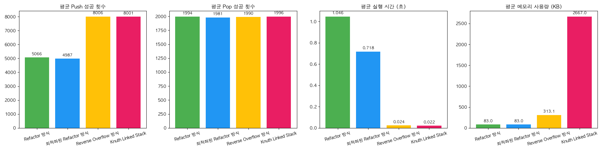

# 실험 분석 (Analysis)

## 실험 개요

이 실험은 다중 스택(multiple stack) 구조의 성능을 비교하기 위해 네 가지 다른 방식(Refactor, 최적화된 Refactor, Reverse Overflow, Knuth Linked Stack)을 사용하여 여러 실험 조건을 진행하였습니다. 실험에서의 주요 측정 항목은 Push, Pop 횟수, 시간, 메모리 사용량입니다. 실험 조건과 각 방식에 대한 성능 비교는 다음과 같습니다.

### 실험 조건 1: PUSH_RATIO=[0.2, 0.2, 0.2, 0.2, 0.2], NUM_STACKS=5, POP_PROB=0.1
- **Refactor 방식**: 평균 Push=2560.4, 평균 Pop=978.8, 평균 시간=0.3169s, 평균 메모리=19.8KB
- **최적화된 Refactor 방식**: 평균 Push=2565.0, 평균 Pop=998.0, 평균 시간=0.4612s, 평균 메모리=19.8KB
- **Reverse Overflow 방식**: 평균 Push=2999.8, 평균 Pop=999.8, 평균 시간=0.0212s, 평균 메모리=34.9KB
- **Knuth Linked Stack**: 평균 Push=3007.4, 평균 Pop=1007.6, 평균 시간=0.0250s, 평균 메모리=524.3KB

### 실험 조건 2: PUSH_RATIO=[0.95, 0.0025, 0.0025, ..., 0.0025], NUM_STACKS=21, POP_PROB=0.5
- **Refactor 방식**: 평균 Push=5008.2, 평균 Pop=4887.0, 평균 시간=0.0426s, 평균 메모리=83.1KB
- **최적화된 Refactor 방식**: 평균 Push=4994.6, 평균 Pop=4844.2, 평균 시간=0.0354s, 평균 메모리=83.2KB
- **Reverse Overflow 방식**: 평균 Push=5005.0, 평균 Pop=4872.6, 평균 시간=0.0334s, 평균 메모리=507.4KB
- **Knuth Linked Stack**: 평균 Push=4995.0, 평균 Pop=4872.0, 평균 시간=0.0258s, 평균 메모리=2701.2KB

### 실험 조건 3: PUSH_RATIO=[0.5, 0.5, 0.0, ..., 0.0], NUM_STACKS=10, POP_PROB=0.8
- **Refactor 방식**: 평균 Push=1993.8, 평균 Pop=1993.6, 평균 시간=0.0182s, 평균 메모리=41.1KB
- **최적화된 Refactor 방식**: 평균 Push=2003.4, 평균 Pop=2001.8, 평균 시간=0.0182s, 평균 메모리=41.2KB
- **Reverse Overflow 방식**: 평균 Push=1993.0, 평균 Pop=1992.4, 평균 시간=0.0201s, 평균 메모리=254.8KB
- **Knuth Linked Stack**: 평균 Push=1976.0, 평균 Pop=1974.6, 평균 시간=0.0181s, 평균 메모리=1350.2KB

### 실험 조건 4: PUSH_RATIO=[0.02, 0.02, ..., 0.02], NUM_STACKS=50, POP_PROB=0.5
- **Refactor 방식**: 평균 Push=4966.8, 평균 Pop=4454.2, 평균 시간=0.0295s, 평균 메모리=165.1KB
- **최적화된 Refactor 방식**: 평균 Push=5008.6, 평균 Pop=4476.8, 평균 시간=0.0297s, 평균 메모리=165.1KB
- **Reverse Overflow 방식**: 평균 Push=4975.6, 평균 Pop=4453.2, 평균 시간=0.0405s, 평균 메모리=1006.6KB
- **Knuth Linked Stack**: 평균 Push=5001.4, 평균 Pop=4465.0, 평균 시간=0.0296s, 평균 메모리=5404.4KB

### 실험 조건 5: PUSH_RATIO=[0.05, 0.05, ..., 0.05], NUM_STACKS=11, POP_PROB=0.2
- **Refactor 방식**: 평균 Push=5073.4, 평균 Pop=2002.8, 평균 시간=1.0404s, 평균 메모리=83.0KB
- **최적화된 Refactor 방식**: 평균 Push=5014.4, 평균 Pop=1976.8, 평균 시간=0.6730s, 평균 메모리=83.0KB
- **Reverse Overflow 방식**: 평균 Push=8019.0, 평균 Pop=1977.8, 평균 시간=0.0248s, 평균 메모리=312.4KB
- **Knuth Linked Stack**: 평균 Push=8001.4, 평균 Pop=1994.6, 평균 시간=0.0231s, 평균 메모리=2667.0KB

---

## 성능 분석

### Push 및 Pop 평균 횟수

- 실험 조건에 따라 Push 횟수는 `Reverse Overflow` 방식과 `Knuth Linked Stack` 방식에서 높은 값을 기록했습니다. 특히, `Reverse Overflow` 방식은 Push 횟수가 상대적으로 높은 편입니다.
- `Refactor` 및 `최적화된 Refactor` 방식은 다소 낮은 Push 횟수를 기록했으나, Pop 횟수는 일정한 수준을 유지했습니다.

### 시간 성능

- `Reverse Overflow` 방식은 시간 성능에서 뛰어난 결과를 보였으며, 평균 시간이 가장 짧았습니다.
- 반면, `Refactor` 방식은 시간이 상대적으로 길었으며, `최적화된 Refactor` 방식도 시간 성능에서 상대적인 차이를 보였습니다.
- `Knuth Linked Stack`은 `Reverse Overflow`보다 약간 긴 시간이 소요되었습니다.

### 메모리 사용량

- `Reverse Overflow` 방식은 메모리 사용량이 다소 높은 편으로, 다른 방식들보다 큰 메모리를 요구했습니다. 이는 다중 스택 구조의 공간 효율성을 고려할 때 중요한 점입니다.
- `Knuth Linked Stack` 방식은 메모리 사용량이 매우 큰 편으로, 특히 `NUM_STACKS`와 `PUSH_RATIO`가 늘어날수록 메모리 사용량이 급격하게 증가했습니다.
- `Refactor`와 `최적화된 Refactor` 방식은 메모리 사용량이 상대적으로 적었습니다.

## 결론

1. **Reverse Overflow 방식**: 평균적인 Push 횟수와 Pop 횟수에서 좋은 성능을 보였으며, 시간이 매우 빠르고 메모리 사용량도 적당히 효율적입니다. 다만, 메모리 사용량이 조금 더 필요하다는 단점이 있지만, 시간 효율성이 중요한 경우에는 적합한 선택입니다.
2. **Knuth Linked Stack 방식**: 메모리 사용량이 크고 시간 성능도 상대적으로 낮지만, 안정적인 성능을 제공합니다.
3. **Refactor 방식**: Push와 Pop 횟수가 적당하고 시간 성능이 비교적 좋은 반면, 메모리 사용량도 효율적입니다.
4. **최적화된 Refactor 방식**: Refactor 방식과 유사하지만 약간 더 낮은 시간 성능을 보입니다. 이는 성능 최적화 과정에서 일정한 trade-off가 있었음을 의미합니다.

### 향후 개선 방향

1. `Reverse Overflow` 방식에서 메모리 사용량을 줄이는 방법을 모색할 필요가 있습니다.
2. `Knuth Linked Stack`의 메모리 사용량을 효율적으로 개선하여 성능을 높일 수 있는 방안을 찾아야 합니다.
3. 각 방식 간의 trade-off를 더욱 분석하여, 실제 적용 환경에 맞는 최적의 방법을 선택하는 것이 중요합니다.
